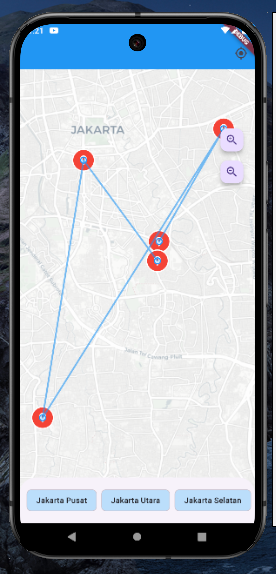

# GOGLE MAP



Goggle map dengan fitur :

- get lokasi user
- mendapatkan nama kecamatan, kota, province dan negara user
- pin lokaasi berdasarkan list lokasi, Dan juga di setiap lokasi di beri radius, dengan kasus.
- setiap lokasi di berigaris penghubung bilamana map di klik, didalam / di luar radius maka akan muncul snack bar yang memberi tahu posisi tap dimana

## INSTALASI

Pertama package yang di butuhkan berdasrkan versi ketika aplikasi di buat

- flutter_map: ^8.2.1
- geolocator: ^14.0.2
- http: ^1.5.0
- latlong2: ^0.9.1
- permission_handler: ^12.0.1

## SET UP

Pertama kita harus setup perizinan.

##### ANDROID

Tambahkan permision di <span style="color:#016FB9">android/app/src/main/AndroidManifest.xml</span>

```
<manifest xmlns:android="http://schemas.android.com/apk/res/android">
    // tambahkan file ini
    <uses-permission android:name="android.permission.ACCESS_FINE_LOCATION" />
    <uses-permission android:name="android.permission.ACCESS_COARSE_LOCATION" />
    <uses-permission android:name="android.permission.INTERNET" />

    <application .....
```

##### IOS

Tambahkan permision di <span style="color:#016FB9">ios/Runner/Info.plist</span>

```
<plist version="1.0">
<dict>
    .....

    // tambahkan file ini
    <key>NSLocationWhenInUseUsageDescription</key>
	<string>Aplikasi memerlukan akses lokasi untuk menampilkan posisi Anda di peta</string>
	<key>NSLocationAlwaysAndWhenInUseUsageDescription</key>
	<string>Aplikasi memerlukan akses lokasi untuk menampilkan posisi Anda di peta</string>

    </dict>
</plist>
```
